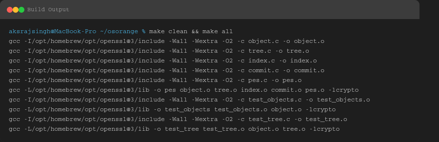
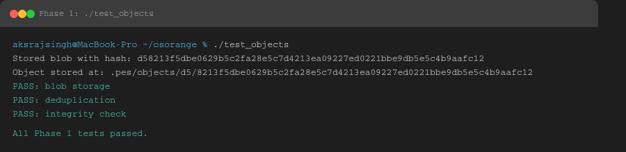
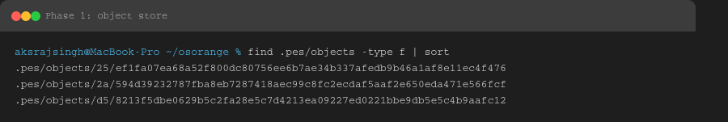
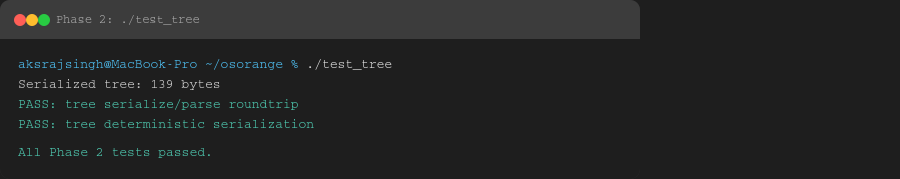
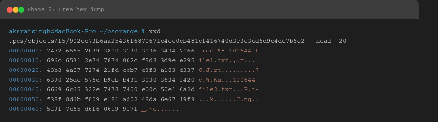
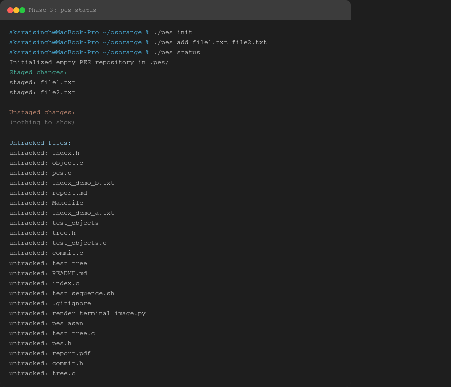
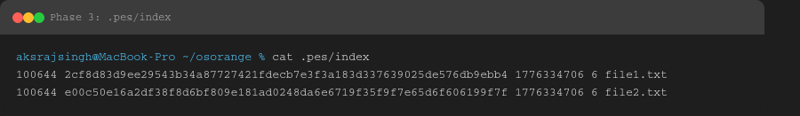
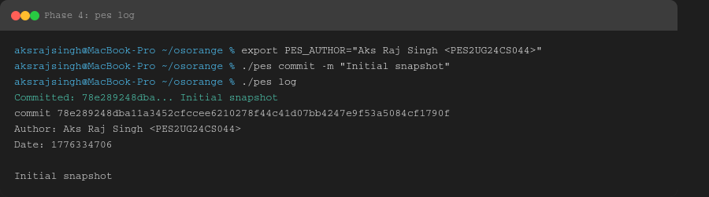
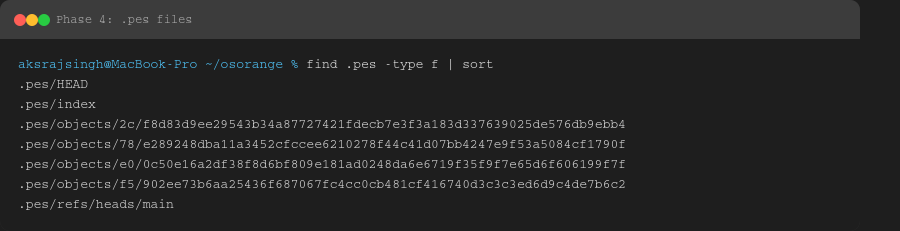
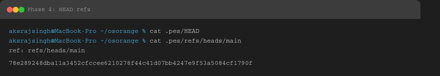

# PES-VCS Lab Report

**Name:** Aks Raj Singh  
**SRN:** PES2UG24CS044  
**Project:** Orange Version Control System (PES-VCS)  
**Date:** April 16, 2026

---

# 1. Build Output

---

# 2. Phase 1: Object Storage

## 2A. Test Output

## 2B. Object Store Structure

---

# 3. Phase 2: Tree Objects

## 3A. Test Output

## 3B. Tree Object Hex Dump

---

# 4. Phase 3: Index (Staging Area)

## 4A. Commands Output

## 4B. Index File Content

---

# 5. Phase 4: Commits

## 5A. Commit Log

## 5B. .pes Directory Structure

## 5C. HEAD and References

---

# 6. Final Integration Test

---

# 7. Analysis Questions

## Q5.1 Branch Checkout

A branch is stored as a reference file pointing to a commit hash. Implementing checkout would involve:

- Updating `HEAD` to point to the new branch
- Reconstructing the working directory from the target commit tree
- Overwriting files carefully

The complexity arises in handling uncommitted changes.

## Q5.2 Dirty Working Directory

Compare:

- Working directory files
- Index entries
- Target commit tree

If differences exist in tracked files, block checkout to avoid data loss.

## Q5.3 Detached HEAD

`HEAD` points directly to a commit instead of a branch.  
New commits are created but not referenced by any branch.  
Recovery is possible by creating a new branch pointing to that commit.

## Q6.1 Garbage Collection

- Traverse all reachable commits from refs
- Mark reachable objects using DFS/BFS
- Delete unmarked objects

A hash set can be used to track visited objects.

## Q6.2 GC Race Condition

If GC runs during commit:

- It may delete objects that are not yet referenced

Git avoids this using locking and reference safety.
